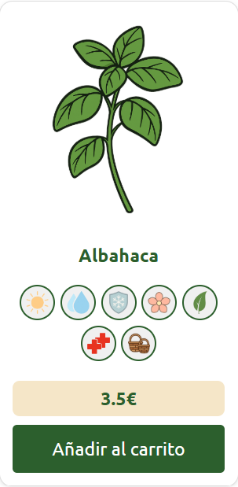

  
  
  # 🌱 Gea - Tienda Online de Semillas

---

Gea es una tienda online de semillas de plantas. El proyecto incluye **5 páginas principales**: Inicio (con estadísticas y FAQ), Tienda (catálogo de 48 productos), Carrito, Login y Sobre Nosotros.

## Estructura del Proyecto

El proyecto está organizado en carpetas claramente diferenciadas:

- **`html/`**: Contiene los 5 archivos HTML principales (index, store, cart, login, about)
- **`css/`**: Hoja de estilos específica para cada página HTML
- **`js/`**: Archivo JavaScript correspondiente a cada página con su lógica de interacción
- **`img/`**: Recursos visuales organizados por categorías de semillas (herb, veg, leg, cer, flo, fru), iconos de propiedades, y assets generales
- **`data/`**: Archivos JSON con información de productos (semillas.json) y usuarios

## Responsive Design

El diseño web se adapta a **4 resoluciones diferentes**:

- **Mini** (smartphones pequeños)
- **Móvil** (smartphones estándar)
- **Tablet** (tablets y dispositivos medianos)
- **Ordenador** (escritorio y pantallas grandes)

Se utilizan media queries y sobre todo grid que ayuda a cambiar entre dimensiones.

## Datos: semillas.json

El archivo `semillas.json` contiene **48 productos** generados con datos simulados para el funcionamiento de la tienda. Cada producto incluye:

- **id**: Identificador único (Primary Key)
- **nombre**: Nombre de la semilla
- **precio**: Precio en euros
- **tipo**: Categoría (hierbas, vegetales, legumbres, cereales, flores, frutas)
- **8 propiedades**: Cuidados, dificultad, estación de siembra, luz, producción, resistencia al frío, riego y extras

Estos datos se cargan dinámicamente mediante `fetch()` en la página de la tienda.

## Navegación

  

La navegación del sitio cuenta con:

- **Header**: Logo de Gea (favicon), menú de navegación para acceder a todas las secciones (Inicio, Tienda, Sobre Nosotros), iconos de login y carrito
- **Footer**: Links rápidos a todas las páginas, iconos de redes sociales (Instagram, Facebook, Twitter) y datos de contacto (email, teléfono, dirección)

## Estructura de la Tienda (Store)

La página de la tienda sigue esta estructura visual:

1. **Sección de Propiedades**: Display grid con los 8 iconos de cultivo y su explicación (luz, riego, dificultad, etc.)

2. **Categorías de Productos**: 6 secciones principales
   - Hierbas Aromáticas
   - Vegetales
   - Legumbres
   - Cereales
   - Flores
   - Frutas

3. **Tarjetas de Producto**: Cada producto muestra:
   - Imagen ilustrativa
   - Nombre de la semilla
   - Iconos de propiedades correspondientes
   - Precio
   - Botón "Añadir al carrito"

4. **Cart Footer**: Barra inferior fija con:
   - Contadores por categoría de productos seleccionados
   - Total acumulado del carrito
   - Botón "Continuar" para proceder al pago

  

## Login

El diseño de la página de login está basado en [este tutorial de YouTube](https://youtu.be/PlpM2LJWu-s).

Características principales:
- **Nav transparente** con efectos de blur y brightness
- **Container central** con formulario de acceso
- **Diseño responsive vertical**: A diferencia del tutorial original (horizontal), optamos por una disposición vertical para optimizar la visualización en móvil y mini

## Páginas del Proyecto

### Index (Inicio)

5 secciones principales:
1. **Hero**
2. **Intro**
3. **Stats**
4. **Benefits**
5. **FAQ**

### Cart (Carrito)
**JavaScript**:
- `renderCart()`: Genera la tabla desde localStorage
- `updateQuantity()`: Incrementa/decrementa cantidades
- `removeFromCart()`: Elimina productos
- `calculateTotals()`: Calcula el total del carrito

### About (Sobre Nosotros)

1. **Misión/Visión/Valores**
2. **Equipo**
3. **Timeline**
4. **Mapa**
5. **Call to Action**

## Diseño de Imagenes
- **Contenido generado con IA**: La mayoría de textos e imágenes fueron creados con IA para facilitar el trabajo y centrarse en el diseño web
  
## Mejoras Futuras del Proyecto

- **Página de detalle por producto**: Implementar con Angular para mostrar información completa de cada semilla
- **Sistema de filtrado avanzado**: Filtros por propiedades (dificultad, estación, tipo de riego, etc.)
---

  <strong>Desarrollado con 💚 por el equipo de Gea</strong>
   
  Miguel, Julio y Dimitiz

